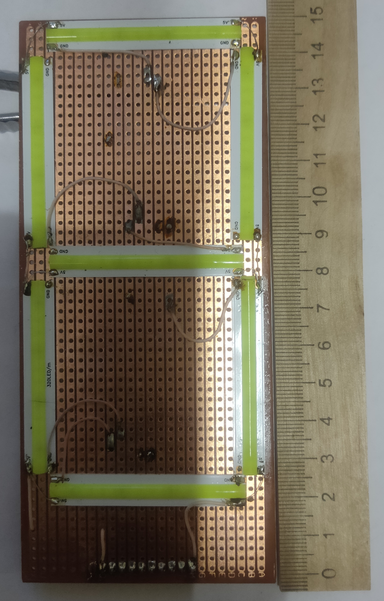
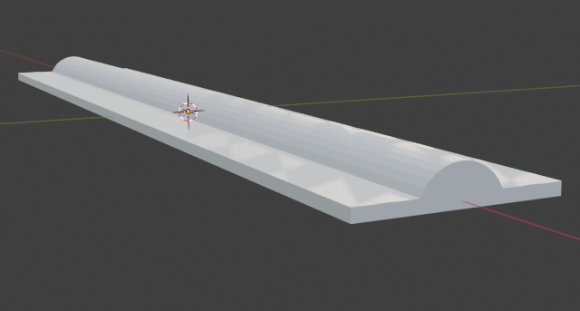
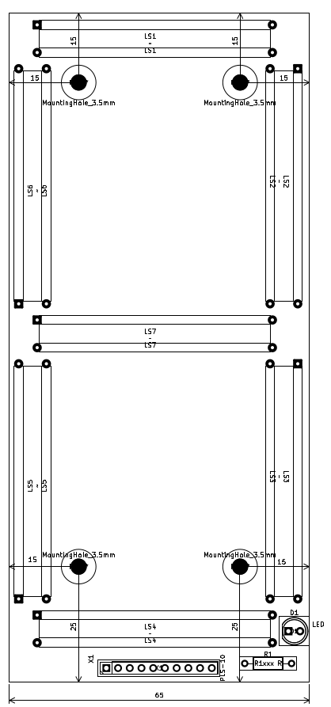
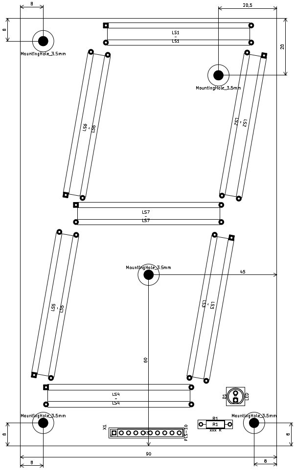

# LED Strip Giant 7‑Segment Display
## [На русском](README_RU.md)

## Working sample

This project describes a simple DIY giant 7‑segment **display** built from low‑cost LED strips and perfboard.  
The goal is to get a large, clearly visible digit with minimal components and manufacturing effort.

## Specifications

- Supply voltage: 5 V  
- Segment current: 90 mA (green COB LED strip)  
- Digit size: 145 × 65 mm (overall dimensions of one segment digit)  

## LED Segments

- Each segment is a piece of green COB LED strip, 50 × 8 mm in size, mounted on double‑sided adhesive tape.  
- The COB (Chip‑on‑Board) technology places many LED chips very close together and encapsulates them in a single layer of compound, producing a continuous, uniform line of light along the entire segment.  

## Construction

- Segments are attached to a copper‑clad or perfboard substrate using their adhesive backing and then wired as a classic 7‑segment digit (one common node and 7 individually driven segments).  
- The layout is optimized for easy hand‑soldering and uses only through‑hole wiring, with no need for a custom PCB.

## Advantages

- Low cost: All parts are standard and inexpensive (generic COB LED strips, perfboard, and a few wires), so the total price of one digit is much lower than a factory‑made large 7‑segment module of similar size.  
- Simplicity: No special manufacturing is required; the digit can be assembled with basic tools and a soldering iron, making it suitable for hobby projects, prototypes, or educational use.  
- Uniform light: Thanks to COB technology, each segment emits an even bar of light without visible individual LEDs, improving legibility and aesthetics of the digit.  
- Scalability: Several digits can be combined into multi‑digit displays (clocks, counters, scoreboards) by repeating the same construction.

## DP Segment

- You won't see the 5mm green LED in the photo, which is the DP segment, because I haven't installed it yet.
Take the LED, find its rated current, and multiply it by 0.7. Calculate the resistance of the current-setting register using the formula:
R = (Vcc - Vled) / Iled. In the formula, voltage is in volts, current is in amperes, and the result is in ohms.

* Vcc is the strip supply voltage, [V]
* Vled is the voltage dropped across the LED when it's lit, [V]
* Iled is the current flowing through the LED when it's lit, [A]

Precision enthusiasts can take into account the voltage across the open switch (collector-emitter/drain-source junction) that connects the LED's cathode to the GND bus by adding it with a minus sign to the numerator of the formula!

# Attention

The LED segments are connected using a common anode circuit.
The supply voltage, as well as the segment current, depends on the LED strip supply voltage.
Select the segment switching switches (transistors) based on the LED strip supply voltage and the segment current at that voltage.
You must measure the segment current yourself!

# Schemes and drawings
Schemes and drawings were made in KiCad 9.0.

## 50x8 mm LED strip segment
                           
## 145x65 mm indicator with no tilt

## 150x90 mm indicator with a 10-degree tilt

